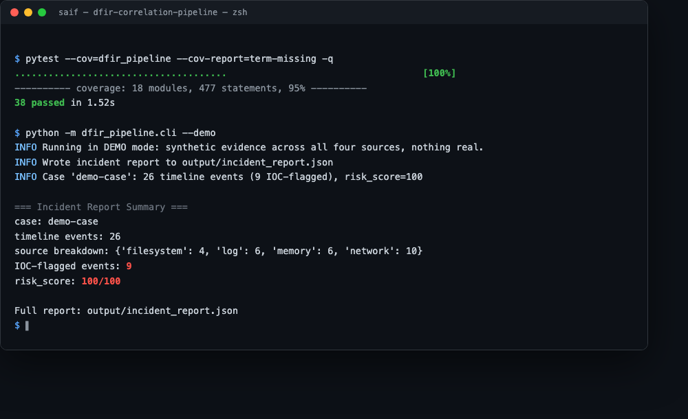
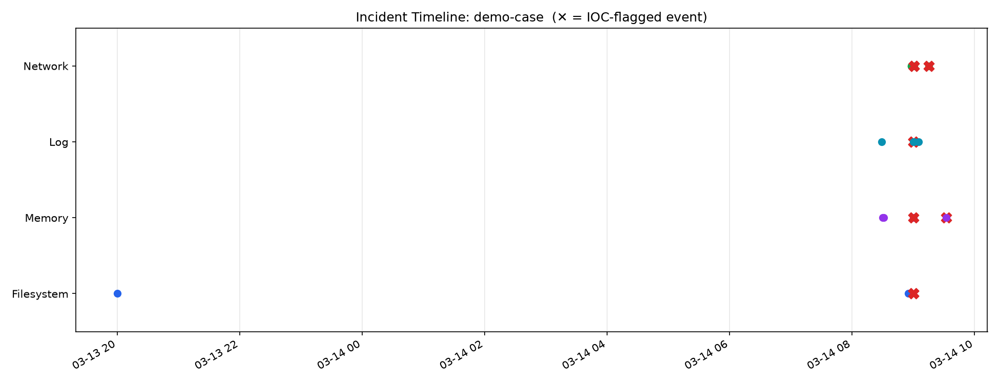
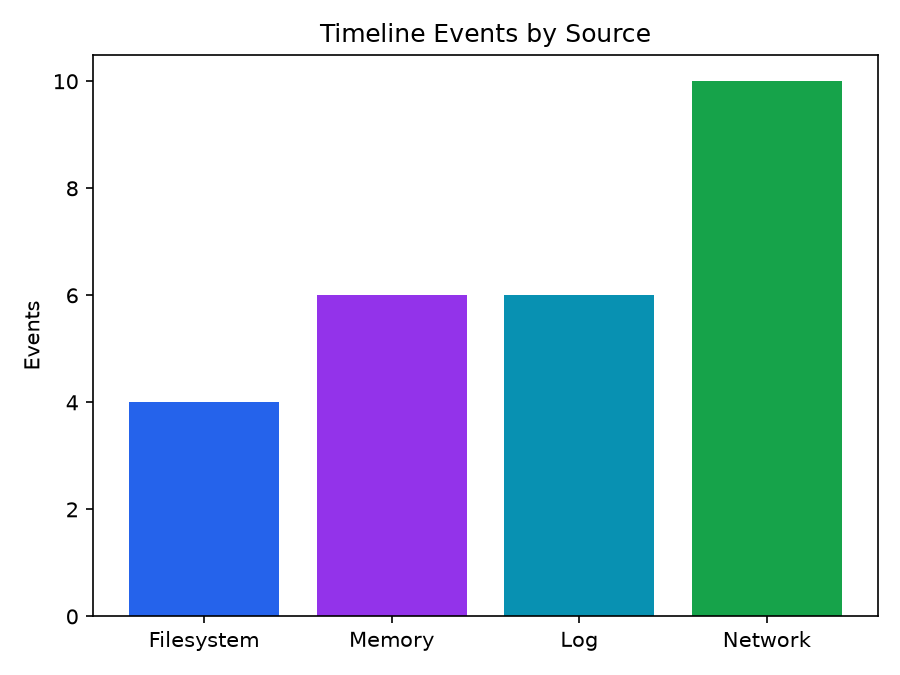
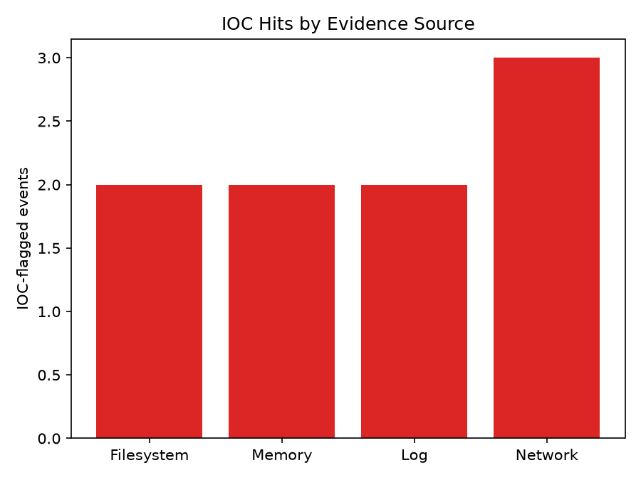
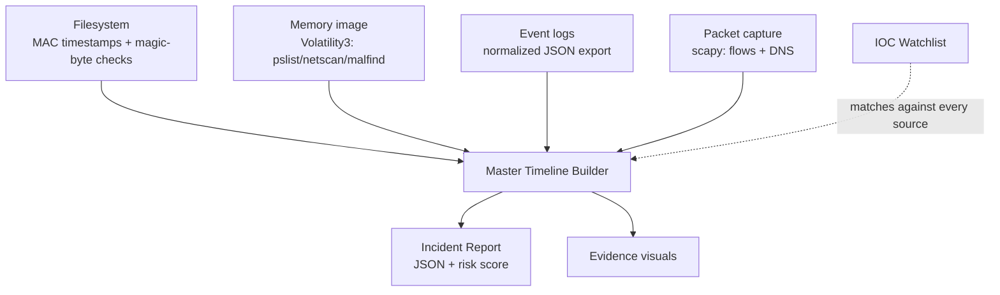
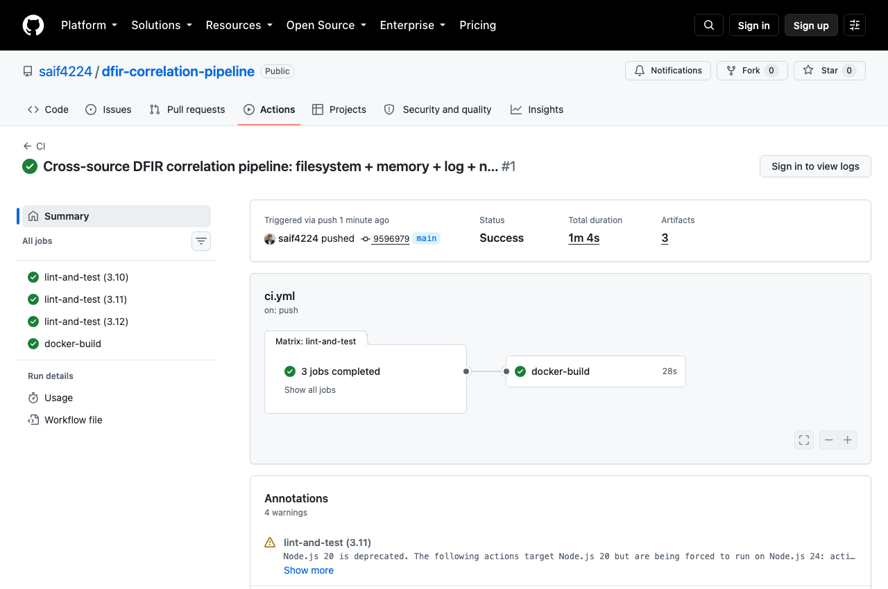

# Cross-Source DFIR Correlation & Timeline Pipeline

[](https://github.com/saif4224/dfir-correlation-pipeline/actions/workflows/ci.yml)
[](.github/workflows/ci.yml)
[](LICENSE)

Automates the part of incident response that doesn't scale by hand: pulling evidence from **four
independent sources** — filesystem (MAC timestamps + disguised-executable heuristics), memory
(real Volatility3 orchestration), logs (normalized Windows/Sysmon event exports), and network
(scapy-parsed PCAP) — and merging them into one **IOC-matched master timeline**, the same
cross-source correlation technique behind tools like Plaso and Velociraptor.

```
Filesystem ──┐
Memory     ──┼──► IOC watchlist match ──► Master timeline (sorted) ──► incident_report.json
Logs       ──┤                                                        + swimlane / summary visuals
Network    ──┘
```

**Never touches real evidence.** Every fixture in this repo — the disk artifacts, the memory
report, the event log export, the packet capture — is synthetic. See
[Scope & safety](#scope--safety) below.

## Why this exists

A real incident rarely announces itself in one place: the dropper shows up on disk, the process it
spawns shows up in memory, the persistence mechanism shows up in the event log, and the C2 beacon
shows up on the wire. Correlating those four views by hand — four different tools, four different
timestamp formats, no shared IOC list — is exactly the kind of mechanical cross-referencing that
should be automated so an analyst's time goes to judgment calls, not spreadsheet-merging.

## Quickstart (demo mode — no real evidence required)

```bash
git clone https://github.com/saif4224/dfir-correlation-pipeline.git
cd dfir-correlation-pipeline
pip install -r requirements.txt
python -m dfir_pipeline.cli --demo
```

Runs the full pipeline against bundled synthetic fixtures for all four sources — a fictional
phishing-to-C2-beacon incident, consistent across every source — and writes
`output/incident_report.json` plus three evidence visuals. No sandbox, no real disk image, no real
memory dump, nothing beyond Python.



Or via Docker:

```bash
docker compose up --build
```

## Live mode (real evidence)

Every source is independently optional — real cases rarely have all four. Filesystem/log/network
analysis need only Python; memory analysis needs [Volatility3](https://github.com/volatilityfoundation/volatility3)'s `vol` on PATH plus a real memory image.

```bash
python -m dfir_pipeline.cli --live --case "Case 2026-001" \
  --fs-root /mnt/evidence \
  --memory-image /evidence/mem.raw \
  --log-file /evidence/security_log_export.json \
  --pcap /evidence/capture.pcap
```

Any subset works: `--live --fs-root /mnt/evidence` alone is a valid run.

## Sample output

`incident_report.json` (truncated):

```json
{
  "case_name": "demo-case",
  "source_counts": { "filesystem": 4, "log": 6, "memory": 6, "network": 10 },
  "ioc_hit_count": 9,
  "risk_score": 100,
  "timeline": [
    {
      "timestamp": "2026-03-14T09:00:05+00:00",
      "source": "filesystem",
      "event_type": "file_write",
      "entity": ".../Downloads/invoice.pdf.exe",
      "description": "File written [double_extension, executable_in_suspicious_path]",
      "matched_iocs": [{ "ioc_type": "filename", "value": "invoice.pdf.exe", "severity": 9 }]
    }
  ]
}
```

Evidence visuals, generated on every pipeline run:

**Cross-source swimlane timeline** — one lane per evidence source, ✕ marks an IOC-flagged event.
Note how the same ~10-minute window lights up across all four lanes simultaneously — that
simultaneity *is* the correlation signal a single-source tool can't give you:



| Events by source | IOC hits by source |
|---|---|
|  |  |

## Architecture



See [`docs/architecture.md`](docs/architecture.md) for the stage-by-stage breakdown, including why
memory forensics is fixture-only rather than hand-built like the PE fixture in the sibling
[`malware-triage-pipeline`](https://github.com/saif4224/malware-triage-pipeline) repo. Short version:

| Stage | What it does |
|---|---|
| **Filesystem** | Walks a directory tree, extracts MAC(B) timestamps, flags disguised executables |
| **Memory** | Orchestrates real Volatility3 (`pslist`/`netscan`/`malfind`); offline fixture fallback |
| **Logs** | Parses normalized Windows Security/Sysmon event exports, flags high-value event IDs |
| **Network** | Parses a real PCAP (scapy) into aggregated flows + DNS queries |
| **Correlation** | Matches every source against one IOC watchlist, merges into a sorted master timeline |
| **Reporting** | Consolidated JSON + swimlane/summary visuals |

## Testing

The whole pipeline is exercised in CI against fixture data (no live sandbox or real evidence required):

```bash
pip install -r requirements-dev.txt
pytest --cov=dfir_pipeline
ruff check .
```

GitHub Actions runs lint + tests across Python 3.10-3.12, executes the demo pipeline end-to-end, and
builds/smoke-tests the Docker image on every push — see [`.github/workflows/ci.yml`](.github/workflows/ci.yml).



## Scope & safety

- **No real evidence, ever.** `tests/fixtures/synthetic_evidence_fs/` is a hand-built directory tree
  with controlled timestamps ([`scripts/generate_fs_fixture.py`](scripts/generate_fs_fixture.py));
  `tests/fixtures/synthetic_capture.pcap` is a real, valid PCAP built with scapy itself
  ([`scripts/generate_pcap_fixture.py`](scripts/generate_pcap_fixture.py)) describing no real
  network; `tests/fixtures/synthetic_volatility_report.json` and
  `tests/fixtures/synthetic_event_logs.json` are hand-written to mirror real tool output shapes.
  None of it comes from a real system, disk, memory dump, or network capture.
- **The IOC watchlist is fictional.** [`data/ioc_watchlist.json`](data/ioc_watchlist.json) only uses
  reserved documentation ranges (RFC 5737 `TEST-NET`, RFC 2606 `.test` TLD) — none of it resolves to
  or represents real infrastructure.
- **The pipeline never modifies evidence or executes anything.** Every source module only reads and
  parses; nothing here writes to, mounts, or alters an evidence source.

## Tech stack

Python 3.10+ · `scapy` (PCAP parsing) · Volatility3 orchestration (`vol` CLI) · `matplotlib`
(evidence visuals) · Docker · GitHub Actions

## License

[MIT](LICENSE)
