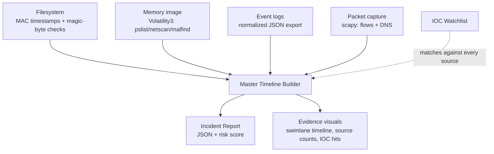

# Architecture

## Stages

| Stage | Module | Responsibility |
|---|---|---|
| Filesystem | `dfir_pipeline/filesystem/mac_timeline.py` | Walks a directory tree, extracts MAC(B) timestamps, flags disguised executables (double extension, magic-byte/extension mismatch) |
| Memory | `dfir_pipeline/memory/volatility_client.py` | Orchestrates Volatility3 (`pslist`/`netscan`/`malfind`), parses JSON output; offline fixture fallback |
| Logs | `dfir_pipeline/logs/event_log_parser.py` | Parses normalized Windows Security/Sysmon event exports, flags high-value event IDs |
| Network | `dfir_pipeline/network/pcap_analyzer.py` | Parses a real PCAP (scapy) into aggregated flows + DNS queries |
| IOC matching | `dfir_pipeline/correlate/ioc_matcher.py` | Matches IPs/domains/filenames/hashes/process names against a watchlist |
| Correlation | `dfir_pipeline/correlate/timeline_builder.py` | Normalizes all four sources into one sorted, IOC-annotated master timeline |
| Reporting | `dfir_pipeline/report/` | Consolidated JSON incident report (with a heuristic risk score) + swimlane/summary visuals |

`dfir_pipeline/pipeline.py` orchestrates correlation + reporting against already-produced typed records from each source, which is what keeps it unit-testable without a live sandbox, a real memory image, or real evidence of any kind — see `tests/`.

## Why memory forensics is fixture-only, not hand-built like the PE fixture

A PE file's structure is fully specified and small enough to hand-build byte-for-byte (see the sibling `malware-triage-pipeline` repo). A memory image is not: Volatility3 walks live kernel data structures (process lists, page tables, handle tables) that only exist in a genuine memory snapshot — there's no honest way to fabricate one without actually capturing a real machine's RAM. So `VolatilityClient` is a real orchestration client (shells out to the real `vol` CLI, parses its real JSON output format) but demo mode loads a fixture that mirrors the *shape* of that output rather than a fabricated raw memory image — the same reasoning as the sandbox-report fixture in `malware-triage-pipeline`.

## Why memory-sourced events share one timestamp

Memory is a single snapshot, not a stream. Only `pslist`'s `CreateTime` is a real historical timestamp; `netscan`/`malfind` results don't carry their own per-record time in Volatility3's output. Those events are anchored to the supplied acquisition (`--snapshot-time`) instead of an invented one - which is exactly how a human analyst would annotate them too.

## Scope note

This pipeline correlates and reports; it never modifies evidence, executes anything, or touches real systems. Every fixture (filesystem tree, memory report, event log export, PCAP) shipped in this repo is synthetic and built by the scripts in `scripts/` - see their file-level docstrings for exactly how each was constructed.
